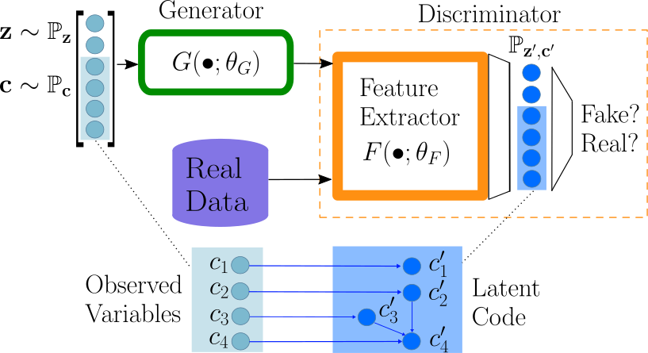

# Interpretable Minority Synthesis for Imbalanced Classification
> Interpretable Minority Synthesis for Imbalanced Classification (IMSIC)
>
> Yi He, Fudong Lin, Xu Yuan and Nian-Feng Tzeng

This is the official implementation of IMSIC.

[paper link]()

## Abstract

Imbalanced data abound in the real-world applications. However, effective learning for separating minority classes from the majority ones remains open and challenging. Although oversampling has been realized as a promising direction for building classifiers via synthesizing minority samples to balance the class priors, modeling the data generating mechanism is still limited, given that the real-world data are often highly dimensioned. Conventional methods are mostly linear and hence cannot capture the complex patterns underlying a high-dimensional space, while deep models suffer from data-hungriness which cannot be fulfilled by the minority class with a very limited size, calling for new effective solutions for imbalanced classification. In response, this paper proposes a novel generative adversarial network (GAN) architecture to model the underlying distribution of data generation by learning interpretable latent representations. Specifically, a Bayesian regularizer is designed for guiding the GAN to extract a set of salient features being interacted in accordance with a given dependency structure. As such, the semantics of the extracted features are controlled in a human-in-the-loop fashion, allowing to synthesize high-quality minority samples with a much improved sample complexity. Extensive experiments substantiate that our approach enjoys robustness across various imbalance settings and can enable simple classifiers to achieve superior classification performance over the state-of-the-arts.





## Requirement

The code was tested on:

- pytorch
- torchvision
- scikit-learn
- numpy
- tqdm

To install requirement:

```python
# install requirement
pip install -r requirements.txt
```


## RUN

Move to source code directory:

```python
# install requirement
cd source
```

### CNN

To train CNN from a pre-train GAN. For mnist:

```python
python main.py --dataset mnist --batch_size 64 --cnn_lr 0.0001 --epochs 8
```

For Fashion-MNIST:

```python
python main.py --dataset fashion-mnist --batch_size 64 --cnn_lr 0.0001 --epochs 25
```

### GAN

To train GAN from scratch:

```python
python grid_search.py --dataset mnist --n_epochs 500 --batch_size 64 --lr 0.0002
```

More details about hyperparameters, please use:

```python
python main.py --help
```


## Citation

